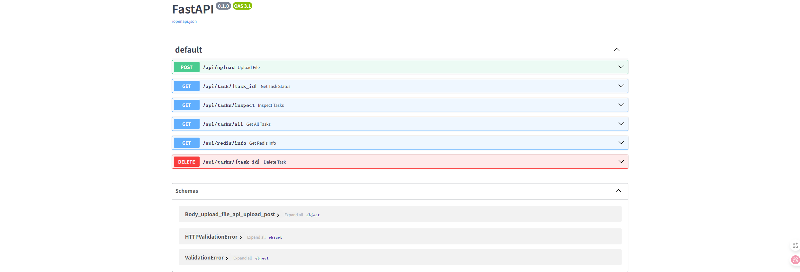
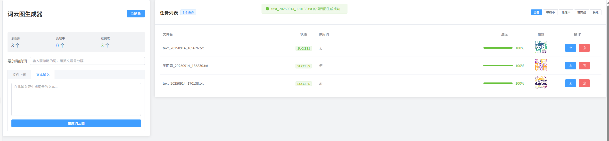
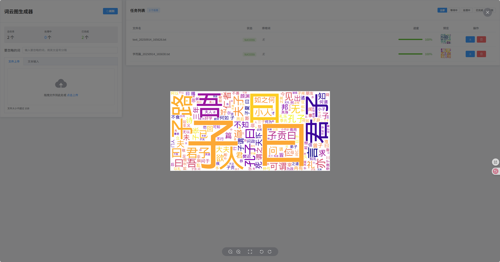

# Word Cloud Generator

An online word cloud generation service based on Vue3 + FastAPI + Redis + Celery

## ✨ Features

- 🚀 **High-performance Async Processing**: Uses Celery + Redis for asynchronous task queue, supports large file processing
- 📊 **Real-time Progress Monitoring**: Displays task processing progress and status in real-time
- 📱 **Responsive Design**: Supports both desktop and mobile access
- 📥 **Multiple Input Methods**: Supports both file upload and text input
- 💾 **Local Storage**: Task status automatically saved locally, persists after page refresh
- 🐳 **Docker Deployment**: One-click deployment with multi-instance load balancing support

## 🎯 Examples

### Interface Preview







## 🚀 Quick Start

### Requirements
- Docker and Docker Compose
- At least 2GB RAM

### One-Click Deployment
```bash
# Clone the project
git clone https://github.com/zhenda-hub/word-cloud-gene.git
cd word-cloud-gene

# Start services
docker-compose up -d
```

### Access Services
- Frontend Interface: http://localhost:5173
- Backend API: http://localhost:8202
- API Documentation: http://localhost:8202/docs
- Redis Management: http://localhost:6379

### Manual Deployment (Development Environment)
```bash
# Backend service
cd backend
pip install -r requirements.txt
uvicorn app.main:app --reload --host 0.0.0.0 --port 8000

# Frontend service  
cd frontend
npm install
npm run dev

# Celery Worker
celery -A app.celery_app worker --loglevel=info

# Redis
redis-server
```

## 🏗️ Technical Architecture

### Frontend Tech Stack
- **Vue 3**: Modern frontend framework
- **Element Plus**: UI component library
- **Vite**: Build tool
- **Axios**: HTTP client

### Backend Tech Stack
- **FastAPI**: High-performance Python web framework
- **Celery**: Distributed task queue
- **Redis**: Message queue and cache
- **Jieba**: Chinese text segmentation library
- **WordCloud**: Word cloud generation library

### Deployment Architecture
```
Frontend (Vue3) → Backend (FastAPI) → Celery Worker → Redis
                    ↑
                 File Storage
```

## 🤝 Contributing

Welcome to contribute code! Please follow these steps:

1. Fork the project
2. Create a feature branch (`git checkout -b feature/AmazingFeature`)
3. Commit your changes (`git commit -m 'Add some AmazingFeature'`)
4. Push to the branch (`git push origin feature/AmazingFeature`)
5. Open a Pull Request

### Development Standards
- Follow PEP 8 (Python) and ESLint (JavaScript) standards
- Use English for commit messages
- New features require corresponding test cases

## 🐛 Issue Reporting

If you encounter any problems or have improvement suggestions, please:

1. Check [existing issues](https://github.com/zhenda-hub/word-cloud-gene/issues)
2. If no related issue exists, [create a new issue](https://github.com/zhenda-hub/word-cloud-gene/issues/new)
3. Provide detailed problem description, reproduction steps, and environment information

## 📄 License

This project is licensed under the MIT License - see the [LICENSE](LICENSE) file for details

## 🙏 Acknowledgments

- [Vue.js](https://vuejs.org/) - Progressive JavaScript Framework
- [FastAPI](https://fastapi.tiangolo.com/) - Modern Python Web Framework
- [Celery](https://docs.celeryq.dev/) - Distributed Task Queue
- [Element Plus](https://element-plus.org/) - Vue3 UI Component Library
- [Jieba](https://github.com/fxsjy/jieba) - Chinese Text Segmentation Library
- [WordCloud](https://github.com/amueller/word_cloud) - Word Cloud Generation Library

---

⭐ If this project is helpful to you, please give it a Star!
