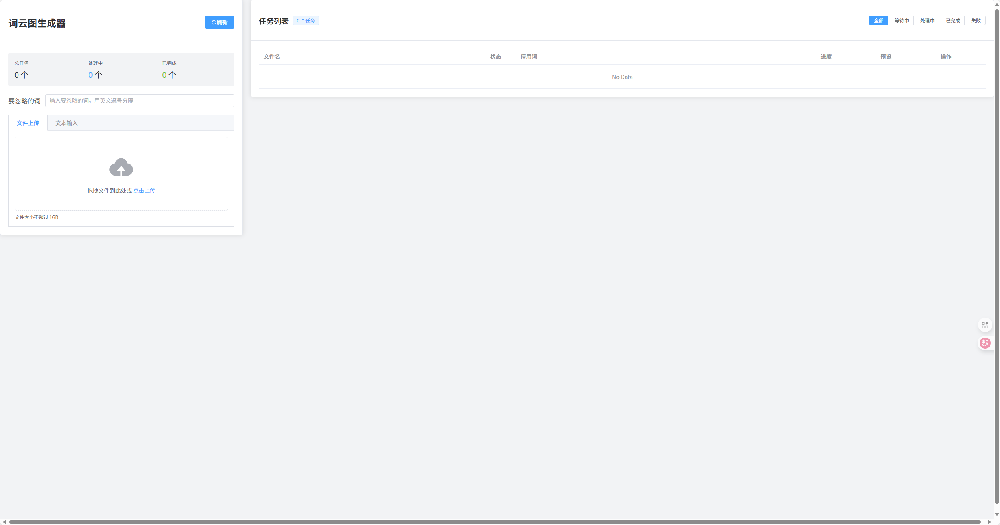
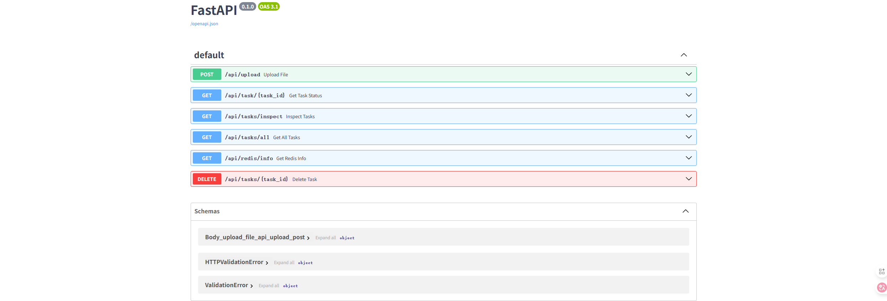
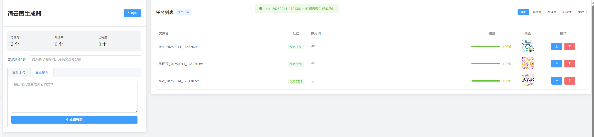
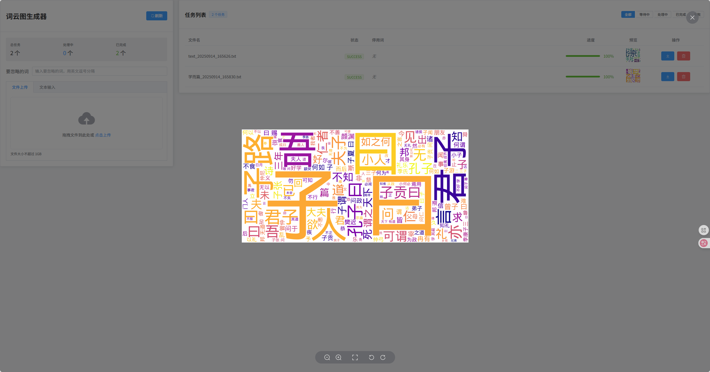
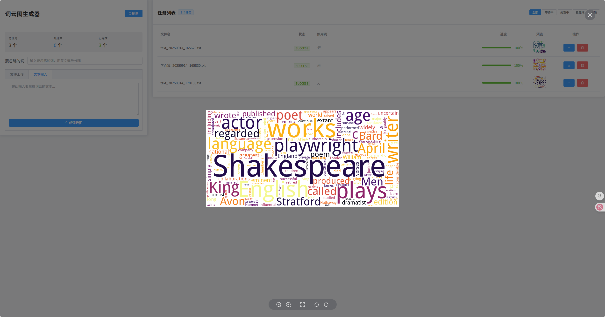

# 词云图生成器

[English](./README.en.md)

[English README](./README.en.md)


基于 Vue3 + FastAPI + Redis + Celery 的在线词云图生成服务

## ✨ 特性

- 🚀 **高性能异步处理**: 使用 Celery + Redis 实现异步任务队列，支持大文件处理
- 📊 **实时进度监控**: 实时显示任务处理进度和状态
- 📱 **响应式设计**: 支持桌面端和移动端访问
- 📥 **多种输入方式**: 支持文件上传和文本输入两种方式
- 💾 **本地存储**: 任务状态自动保存到本地，刷新页面不丢失
- 🐳 **Docker 部署**: 一键部署，支持多实例负载均衡

## 🎯 示例

### 界面预览







## 🚀 快速开始

### 环境要求
- Docker 和 Docker Compose
- 至少 2GB 内存

### 一键部署
```bash
# 克隆项目
git clone https://github.com/zhenda-hub/word-cloud-gene.git
cd word-cloud-gene

# 启动服务
docker-compose up -d
```

### 访问服务
- 前端界面: http://localhost:5173
- 后端 API: http://localhost:8202
- API 文档: http://localhost:8202/docs
- Redis 管理: http://localhost:6379

### 手动部署（开发环境）
```bash
# 后端服务
cd backend
pip install -r requirements.txt
uvicorn app.main:app --reload --host 0.0.0.0 --port 8000

# 前端服务  
cd frontend
npm install
npm run dev

# Celery Worker
celery -A app.celery_app worker --loglevel=info

# Redis
redis-server
```

## 🏗️ 技术架构

### 前端技术栈
- **Vue 3**: 现代化前端框架
- **Element Plus**: UI组件库
- **Vite**: 构建工具
- **Axios**: HTTP客户端

### 后端技术栈
- **FastAPI**: 高性能Python Web框架
- **Celery**: 分布式任务队列
- **Redis**: 消息队列和缓存
- **Jieba**: 中文分词库
- **WordCloud**: 词云生成库

### 部署架构
```
前端 (Vue3) → 后端 (FastAPI) → Celery Worker → Redis
                    ↑
                文件存储
```

## 🤝 参与贡献

欢迎贡献代码！请遵循以下步骤：

1. Fork 本项目
2. 创建特性分支 (`git checkout -b feature/AmazingFeature`)
3. 提交更改 (`git commit -m 'Add some AmazingFeature'`)
4. 推送到分支 (`git push origin feature/AmazingFeature`)
5. 开启 Pull Request

### 开发规范
- 遵循 PEP 8 (Python) 和 ESLint (JavaScript) 规范
- 提交信息使用英文描述
- 新功能需要添加相应的测试用例

## 🐛 问题反馈

如果您遇到任何问题或有改进建议，请：

1. 查看 [现有问题](https://github.com/zhenda-hub/word-cloud-gene/issues)
2. 如果没有相关issue，请[创建新issue](https://github.com/zhenda-hub/word-cloud-gene/issues/new)
3. 提供详细的问题描述、复现步骤和环境信息

## 📄 许可证

本项目采用 MIT 许可证 - 查看 [LICENSE](LICENSE) 文件了解详情

## 🙏 致谢

- [Vue.js](https://vuejs.org/) - 渐进式JavaScript框架
- [FastAPI](https://fastapi.tiangolo.com/) - 现代Python Web框架
- [Celery](https://docs.celeryq.dev/) - 分布式任务队列
- [Element Plus](https://element-plus.org/) - Vue3 UI组件库
- [Jieba](https://github.com/fxsjy/jieba) - 中文分词库
- [WordCloud](https://github.com/amueller/word_cloud) - 词云生成库

---

⭐ 如果这个项目对您有帮助，请给个Star支持一下！
